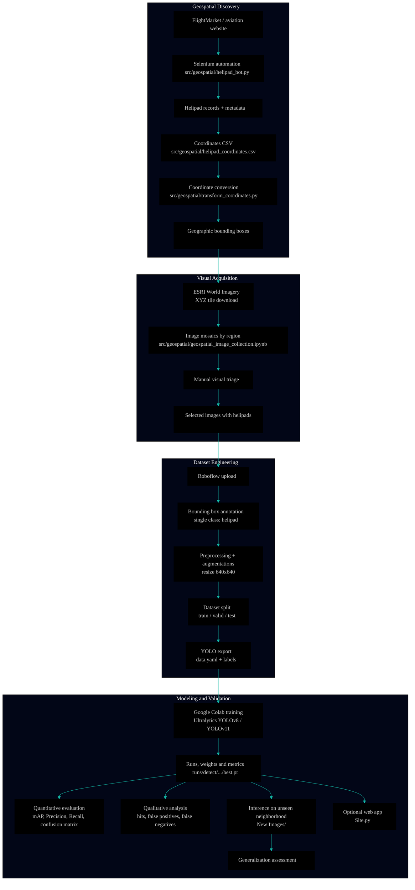

# 3- [Computer Vision / Helipoint Detector]()

### [Helipad Detection in Satellite Images of São Paulo with YOLO]()

<p align="center" style="margin: 0;">
  <a href="https://github.com/Mindful-AI-Assistants/3-project-ai-ml-yolo-helipoint-detector" rel="noopener noreferrer">
    
  </a>
</p>

<p align="center" style="margin: 0;">
  <a href="https://github.com/Mindful-AI-Assistants/3-project-ai-ml-yolo-helipoint-detector/blob/main/notebooks/model_analysis.ipynb" rel="noopener noreferrer">
    
  </a>

  <a href="https://github.com/Mindful-AI-Assistants/3-project-ai-ml-yolo-helipoint-detector/tree/main/artifacts/runs" target="_blank" rel="noopener noreferrer">
    
  </a>
</p>

<p align="center">
  
</p>

<p align="center">
  
  
</p>

<p align="center">
  
  
  
</p>

<br><br>

## [Institutional Information]()

[**Institution:**]() Pontifical Catholic University of São Paulo (PUC‑SP) — FACEI  
[**Course:**]() BSc in Humanistic AI & Data Science — 5th semester — 2026  
[**Subject:**]() Machine Learning / Computer Vision — YOLO  
[**Project:**]() P2 — Object Detection in Satellite Images with YOLO  
[**Professor:**]() Rooney Ribeiro Albuquerque Coelho  

**Project Authors (Helipoint Detector):**  
- Carlos Antonio dos Santos Roth Gorham  
- Fabiana ⚡️ Campanari  
- Pedro Vyctor ✨ Almeida  

<br><br>

> [!IMPORTANT]
>
> This repository documents an end-to-end academic project in Computer Vision for automatic 
> detection of **helipads on rooftops** using satellite images of the city of São Paulo.  
> The focus goes beyond model training: it emphasizes **dataset construction**, **annotation governance**, **reproducibility**, and **evaluation on unseen neighborhoods**, in line with the briefing of Project 2 in the Machine Learning course.

<br><br>

## [Table of Contents]()

- [Project Definition](#project-definition)
- [Objective](#objective)
- [Why Helipads?](#why-helipads)
- [Data Source](#data-source)
- [Project Context](#project-context)
- [Business and Research Problem](#business-and-research-problem)
- [Extra Automation Contribution](#extra-automation-contribution)
- [Geospatial Visualization (Kepler.gl)](#geospatial-visualization-keplergl)
- [Overall Flow Architecture](#overall-flow-architecture)
- [AI/ML Ops Pipeline](#aiml-ops-pipeline)
- [Repository Structure](#repository-structure)
- [What is `data/raw/helipad_dataset.rar`?](#what-is-helipontorar)
- [What is Roboflow in This Project?](#what-is-roboflow-in-this-project)
- [Methodology](#methodology)
- [Full Technical Pipeline](#full-technical-pipeline)
- [Image Collection and Generation](#image-collection-and-generation)
- [Annotation and Roboflow](#annotation-and-roboflow)
- [Modeling with YOLO](#modeling-with-yolo)
- [Evaluation](#evaluation)
- [Inference and Generalization](#inference-and-generalization)
- [Web Application (Optional Layer)](#web-application-optional-layer)
- [Gains from the Extra Resource](#gains-from-the-extra-resource)
- [Educational Value](#educational-value)
- [Image and Text Sources](#image-and-text-sources)
- [Technologies Used](#technologies-used)
- [How to Run](#how-to-run)
- [Deliverables Covered](#deliverables-covered)
- [Results Analysis](#results-analysis)
- [Strengths, Limitations and Future Improvements](#strengths-limitations-and-future-improvements)
- [Ethics, LGPD and Governance](#ethics-lgpd-and-governance)
- [Image Attribution](#image-attribution)
- [References](#references)
- [Acknowledgements](#acknowledgements)
- [Final Statement](#final-statement)

<br><br>

## [Project Definition]()

The **Helipoint Detector** project implements a full **Object Detection** pipeline to identify helipads on rooftops in the city of São Paulo, using high-resolution aerial and orbital imagery and models from the **YOLOv8/YOLOv11** family.

The repository covers the entire lifecycle of an applied AI system in computer vision: programmatic image collection, geospatial automation, dataset creation and curation, annotation, preprocessing, training, quantitative and qualitative evaluation, inference on unseen neighborhoods and, optionally, an application layer for demo purposes.

The repository was designed to present the complete lifecycle of an AI application in a documented and academically transparent form, making it useful for professors, beginner practitioners, and students learning object detection with real urban imagery.

Rather than relying on a ready-made benchmark, the project emphasizes the construction of an original dataset, reproducible experimentation, and inference on unseen regions.

<br><br>

## [Objective]()

The main objective is to build an **end-to-end system** capable of detecting helipads on rooftops in the city of São Paulo, following all model lifecycle stages defined in the briefing:

- programmatic acquisition of satellite data  
- visual curation and tile filtering  
- annotation with well-defined bounding boxes  
- preprocessing and augmentations  
- training and monitoring in Colab  
- quantitative evaluation and qualitative error analysis  
- inference on an entire neighborhood not used during training  

From an educational perspective, the work was also designed to help students understand how a real AI pipeline is built, validated, and communicated. The project therefore integrates data collection, annotation, preprocessing, model training, evaluation, and simple deployment in one coherent workflow.

Methodologically, the project reinforces that model performance is directly tied to **data quality**, annotation consistency and geographical diversity, rather than small tweaks to the architecture.

<br><br>

## [Why Helipads?]()

Helipads are a compelling educational target because they often present a distinctive top-down geometric pattern while still being difficult enough to create realistic detection challenges.

In urban satellite imagery, helipads may be confused with rooftop structures, sports markings, bright reflective surfaces, or architectural patterns. This makes them ideal for discussing false positives, annotation quality, and model generalization.

<br><br>

## [Data Source]()

The project dataset was built from satellite imagery collected over São Paulo, with a focus on neighborhoods relevant to the academic briefing and regions where helipads are more likely to appear.

The geographical scope follows the briefing: **city of São Paulo**, focusing on neighborhoods near the PUC‑SP campus in Perdizes and regions with high helipad density, such as:

- Perdizes, Higienópolis, Pacaembu and Sumaré  
- Paulista Avenue, Itaim Bibi and Pinheiros  
- Faria Lima, Berrini, Vila Olímpia and Brooklin  
- other relevant urban areas such as Morumbi and adjacent regions  

### [Image sources]()

- **ESRI World Imagery (XYZ tiles)** — main source, with sub-meter resolution and programmatic HTTP access  
- **Google Earth Web** — complementary source, used only for punctual captures of specific targets, not for bulk collection  
- **GeoSampa** — mentioned as an alternative high-resolution source, possible extra beyond the base scope  

Images are stored as `.jpg` or `.png`, as required by the project.

Whenever imagery or derived mosaics are reproduced, the required attribution is:  
**Source: Esri, Maxar, Earthstar Geographics, and the GIS User Community**.

<br><br>

## [Project Context]()

The work was developed in the context of **Project 2 — Object Detection in Satellite Images with YOLO**, whose briefing requires each group to:

- choose **a single target class**  
- build an **original dataset**, without using pre-made sets  
- use **ESRI World Imagery (XYZ tiles)** as the main image source  
- perform programmatic collection, annotation, training, evaluation and inference on an unseen neighborhood  
- deliver an annotated dataset, notebooks, model weights, report and presentation  

The central pedagogical message is that **around 80% of the effort in AI is in the data, not in the architecture**. The YOLO model is practically the same for all groups; the real differentiator comes from dataset quality, manual curation and annotation consistency.

<br><br>

## [Business and Research Problem]()

Manually identifying helipads in dense urban environments is a slow, subjective and hard-to-scale task. On high-resolution imagery, rooftops with circular patterns, HVAC equipment, sport markings, shadows, reflections and urban geometry can visually resemble the characteristic helipad “H”.

This project addresses that challenge with an **Object Detection** pipeline that turns raw geospatial imagery into structured visual intelligence, reducing manual effort and enabling:

- faster, more systematic helipad localization  
- assessment of the model’s generalization ability across different neighborhoods  
- study of error patterns in real urban contexts  
- organized and reproducible data, image and evidence handling  

<br><br>

## [Extra Automation Contribution]()

Beyond the minimum briefing requirements, the group developed an **extra geospatial automation resource** to speed up helipad discovery before the annotation stage.

### [Technical title of the contribution]()

**Extra Resource — Automation System to Speed Up the Search for Geographic Points and Helipads**

### [Core idea]()

Instead of relying solely on manual inspection in maps, the system:

1. queries a public aviation website with airport and helipad records  
2. automates navigation and scraping with Selenium  
3. extracts geographic coordinates and metadata for each helipad  
4. converts these coordinates into geographic bounding boxes  
5. uses these boxes as input to download ESRI satellite tiles  
6. generates mosaics ready for triage, annotation and upload to Roboflow  

This resource drastically reduces target search time and strengthens construction of a broader, traceable dataset useful for future training cycles.

### [Geospatial visualization]()

The dashboard's **🗺️ Map** tab (Streamlit, Folium) shows two real, separately-labeled layers:

- 🟢 **São Paulo training neighborhoods** (10 regions) — region-level bounding boxes from `src/data_preparation/image_preprocessing.ipynb`, saved to `src/geospatial/sp_neighborhoods_bbox.csv`. Two of these are labeled `Av_Paulista (trecho 1)` / `(trecho 2)`: the source notebook defines two bounding boxes with the same name, and their footprints overlap ~62–68% — i.e. two slightly-offset image-collection passes over the same avenue, not two different places. `Faria_Lima` was added manually (real geocoded coordinates, Jardim Paulistano) since it was listed as a target neighborhood in this README but had no corresponding bounding box in the source notebook — its bounding box has not yet been used to actually collect/curate training tiles, unlike the other 9.
- 🔵 **Discovery dataset** (129 candidates, other Brazilian states) — from `src/geospatial/helipad_scraper.py`, saved to `src/geospatial/helipad_coordinates_bbox.csv`.

The discovery-dataset layer is additionally rendered as an interactive [Kepler.gl](https://kepler.gl/) map (point layer + density heatmap, dark theme), loaded on demand in the same tab:

- Config: `src/geospatial/keplergl_map_config.json`
- Standalone export: `src/geospatial/keplergl_map_loaded.html`
- Generated by the Kepler section of `yolo_training_exp3.ipynb`

> [!NOTE]
> The São Paulo layer is at **neighborhood/region granularity**, not per-individual-helipad — that finer-grained lookup doesn't exist yet (it would require inverting `deg2tile` on each annotated tile). Good enough to show *where* the training data comes from geographically, not to pinpoint each detected helipad.

<br><br>

## [Overall Flow Architecture]()

The solution can be viewed as an architecture with **seven main blocks**:

1. **Helipad discovery** — automation on an aviation website to locate records with coordinates  
2. **Geographic extraction** — conversion and normalization of coordinates to usable decimal format  
3. **Geographic perimeter generation** — creation of bounding boxes around each point  
4. **Visual acquisition** — download of ESRI World Imagery satellite tiles based on these boxes  
5. **Visual triage** — manual selection of crops with clear helipad presence  
6. **Annotation and versioning** — use of Roboflow for labeling, preprocessing, splits and augmentations  
7. **Training, evaluation and inference** — YOLO training in Colab, performance measurement and generalization tests on unseen neighborhoods  

<br><br>

## [AI/ML Ops Pipeline]()



The pipeline should be understood as a learning architecture as much as a software architecture. It shows how raw geospatial imagery is gradually transformed into a validated and demonstrable AI artifact.

<br><br>

## [Repository Structure]()

The repository structure was organized to reflect pipeline stages, including geographic automation, image generation, training, inference, evaluation and documentation.

```bash
Helipoint Detector
├── .devcontainer
│   └── devcontainer.json
├── analysis_yolo_results
│   ├── Analysis.ipynb
│   └── Analysis_yolo_results.md
├── apps
│   └── streamlit_app
│       └── app.py
├── artifacts
│   └── runs
│       ├── runs
│       └── runs_zipped.zip
├── briefing
│   ├── 3315-264
│   │   ├── T_ORTO_3315-264_IRGB_1000.j2w
│   │   └── T_ORTO_3315-264_IRGB_1000.jp2
│   ├── briefing_assets 
│   │   ├── 3315-264
│   │   ├── 🇧🇷1-Briefing.pdf
│   │   └── 🇬🇧1-Briefing_en.pdf
│   └── notebooks
│       ├── Projeto_P2_Mosaico_Perdizes.ipynb
│       └── Projeto_P2_Mosaico_Perdizes_HIRES.ipynb
├── configs
│   └── data.yaml
├── data
│   ├── README.dataset.txt
│   ├── README.roboflow.txt
│   ├── raw
│   │   └── helipad_dataset.rar
│   ├── tiles
│   │   ├── center_hires_annotated_mosaic.png
│   │   ├── center_hires_full_mosaic.jpg
│   │   ├── center_hires_mosaic_preview.jpg
│   │   ├── center_hires_tiles_sample.png
│   │   ├── center_mosaic_tiles
│   │   ├── tile_z19_x194543_y298181.jpg
│   │   ├── tile_z19_x194545_y298183.jpg
│   │   ├── tile_z19_x194545_y298184.jpg
│   │   ├── tile_z19_x194546_y298177.jpg
│   │   ├── tile_z19_x194546_y298178.jpg
│   │   ├── tile_z19_x194546_y298179.jpg
│   │   ├── tile_z19_x194546_y298180.jpg
│   │   ├── tile_z19_x194547_y298176.jpg
│   │   ├── tile_z19_x194548_y298180.jpg
│   │   ├── tile_z19_x194548_y298181.jpg
│   │   ├── tile_z19_x194548_y298183.jpg
│   │   └── tile_z19_x194549_y298187.jpg
│   └── training
│       └── yolo_dataset
├── docs
│   ├── MLOps-Architecture.md
│   └── governance
│       └── On the Economic and Governance Mechanisms forthe Agentic Web -  A Global South Perspective.pdf
├── notebooks
│   └── model_analysis.ipynb
├── packages.txt
├── reports
│   ├── executive_analysis
│   │   ├── 🇧🇷Helipoint_Detector_Model_Performance_and_Data_Analysis.pages
│   │   ├── 🇧🇷Helipoint_Detector_Model_Performance_and_Data_Analysis.pdf
│   │   ├── 🇬🇧Helipoint_Detector_Model_Performance_and_Data_Analysis.pages
│   │   └── 🇬🇧Helipoint_Detector_Model_Performance_and_Data_Analysis.pdf
│   ├── model_outputs
│   │   └── detect
│   └── yolo_results_analysis.md
├── requirements.txt
├── src
│   ├── data_preparation
│   │   └── image_preprocessing.ipynb
│   ├── geospatial
│   │   ├── geospatial_image_collection.ipynb
│   │   ├── helipad_bot.py
│   │   ├── helipad_coordinates.csv
│   │   └── transform_coordinates.py
│   └── training
│       └── yolo_training.ipynb
```

This organization facilitates navigation, reproducibility and project evolution, clearly separating collection, preprocessing, training, inference and application.

<br><br>

## [What is `data/raw/helipad_dataset.rar`?]()

`data/raw/helipad_dataset.rar` is the compressed annotated dataset used in the project workflow.

It is not a prebuilt third-party benchmark. Instead, it represents the packaged output of the group’s own dataset-building process: programmatic tile acquisition, manual curation, annotation, export in YOLO-compatible format, and organization for training reuse.

This distinction is academically important because it makes clear that the dataset itself is part of the project deliverable, not an external shortcut.

<br><br>

## [What is Roboflow in This Project?]()

In this project, **Roboflow** was used as the annotation and dataset management platform rather than as the origin of the imagery.

Its role was to support image upload, bounding-box labeling, dataset versioning, augmentation, train/validation/test splitting, and export in YOLOv8-compatible format. In practical terms, Roboflow bridges the gap between raw tiles and a training-ready object detection dataset.

<br><br>

## [Methodology]()

The project follows an end-to-end methodology aligned with educational best practices in applied Computer Vision.

1. **Data collection**: satellite tiles are collected programmatically from ESRI World Imagery.  
2. **Manual curation**: irrelevant tiles are discarded to improve dataset quality.  
3. **Annotation**: helipads are labeled with tight bounding boxes in Roboflow.  
4. **Preprocessing**: the dataset is standardized and split into training, validation, and test subsets.  
5. **Training**: a YOLO model is trained in a GPU-enabled environment.  
6. **Evaluation**: performance is examined with metrics and qualitative error analysis.  
7. **Inference**: the trained model is applied to unseen images and new geographic areas.  
8. **Application layer**: a lightweight interface makes the model easier to demonstrate and inspect.  

This methodology highlights a key lesson in AI education: the quality of results is strongly influenced by data engineering and annotation decisions, not only by the network architecture.

<br><br>

## [Full Technical Pipeline]()

The Helipoint Detector technical pipeline can be summarized in 12 steps:

1. Discover helipad records on an aviation website
2. Extract coordinates and location information
3. Save and organize the data in `src/geospatial/helipad_coordinates.csv`
4. Convert coordinates into geographic bounding boxes
5. Download ESRI World Imagery satellite tiles
6. Build mosaics per neighborhood or region
7. Manually triage mosaics, keeping only images with helipads
8. Upload selected images to Roboflow
9. Annotate helipads with consistent bounding boxes
10. Generate dataset versions with resize, splits and augmentations, exporting in YOLO format
11. Train YOLO models in Colab, monitoring metrics and train/validation curves
12. Run inference on unseen neighborhoods and analyze results

This turns a manual, scattered search into a more scalable, traceable and reproducible process.

<br><br>

## [Image Collection and Generation]()

### [Programmatic collection (ESRI World Imagery)]()

Programmatic collection follows the XYZ tile pattern of the **ESRI World Imagery** public service, as recommended in the briefing:

- define **zoom** by target type
- use `z = 19` for helipads and other small targets
- define **bounding boxes** per neighborhood `(lon_min, lat_min, lon_max, lat_max)`
- convert bounding boxes to tile indices `(z, x, y)` via a `deg2tile` function
- download each tile, checking HTTP status and filtering placeholders
- organize tiles into folders by neighborhood and zoom

The `src/geospatial/geospatial_image_collection.ipynb` notebook generalizes this flow for multiple coordinates and bounding boxes, reading `src/geospatial/helipad_coordinates.csv` and producing mosaics and crops ready for triage.

### [Complementary manual collection (Google Earth Web)]()

In some cases, **Google Earth Web** may be used as a complement:

- only for specific helipad examples
- preserving consistent zoom
- cropping approximately square areas and resizing to `640×640`

Bulk screenshot collection from Google is not used, in line with usage restrictions and the briefing.

### [Curation and dataset volume]()

In alignment with the project:

- minimum volume of **200 images with the target object** after curation
- geographical diversity with **at least 3 different neighborhoods** in training
- holdout of at least **1 fully unseen neighborhood** for final generalization testing
- manual triage of tiles, discarding crops without helipads

Curation is not only an operational step; it is also part of the academic evaluation.

<br><br>

## [Annotation and Roboflow]()

Image annotation was carried out with focus on consistency and alignment with course rules.

### [Annotation tool]()

**Roboflow** is used as the central platform for:

- uploading selected images
- drawing bounding boxes
- standardizing labels (a single class: helipad)
- resizing to `640×640`
- data augmentation and version creation
- splitting into `train / valid / test`
- exporting in **YOLOv8/YOLOv11** format

Other tools like CVAT.ai are compatible, but the main flow is structured around Roboflow for simplicity.

### [Annotation standards]()

- single target class
- **tight** bounding boxes, without excessive area
- written criteria for partially visible objects, shadows, reflections and ambiguous cases
- annotation work shared across team members, not concentrated in a single person

### [Preprocessing and splits]()

In Roboflow, the following were configured:

- resize to `640×640`
- augmentations such as 90° rotations, horizontal/vertical flips and small brightness/contrast changes
- standard splits:
  - **70% train**
  - **20% validation**
  - **10% test**

The final export produces the structure expected by YOLO and is stored in `data/training/yolo_dataset/`:

```bash
dataset/
├── data.yaml
├── train/
│   ├── images/
│   └── labels/
├── valid/
│   ├── images/
│   └── labels/
└── test/
    ├── images/
    └── labels/
```

Each `.txt` in `labels/` contains, per line, normalized coordinates `(class_id, x_center, y_center, width, height)`.

<br><br>

## [Modeling with YOLO]()

Detector training was done with **Ultralytics YOLO** on Google Colab with a T4 GPU, following briefing recommendations.

### [Training stack]()

- Python 3.x
- PyTorch
- `ultralytics` library
- `roboflow` library for dataset integration
- Jupyter Notebook / Google Colab Free (T4 GPU)

### [Base configuration]()

Example snippet used in the notebooks:

```python
!pip install -q ultralytics roboflow

from ultralytics import YOLO

model = YOLO('yolov8n.pt')  # or 'yolo11n.pt'

results = model.train(
    data='configs/data.yaml',
    epochs=30,
    imgsz=640,
    batch=16,
    device=0,
    seed=42,
    project='runs',
    name='exp1'
)
```

### [Experiment strategy]()

In line with the briefing, **at least two experiments** were run, varying one hyperparameter at a time (for example, `epochs`, `batch` or `imgsz`) and comparing results.

All relevant hyperparameters are recorded to allow pipeline re-execution, and YOLO automatically saves the best checkpoint to:

```bash
artifacts/runs/runs/detect/exp1/weights/best.pt
```

<br><br>

## [Evaluation]()

Model evaluation is carried out on two complementary fronts: **quantitative metrics** and **qualitative analysis**.

### [Quantitative metrics]()

The following are analyzed:

- **mAP@0.5**
- **mAP@0.5:0.95**
- **Precision (P)**
- **Recall (R)**
- **Confusion matrix**

Additionally, curves are inspected for:

- **loss** (box, cls, dfl) per epoch
- **Precision / Recall** across training

### [Key concepts]()

- **Precision**: proportion of positive detections that are correct
- **Recall**: proportion of real objects detected by the model
- **mAP**: mean Average Precision across IoU thresholds
- **IoU (Intersection over Union)**: overlap between predicted and annotated boxes
- **False Positive (FP)**: model detects a helipad where there is none
- **False Negative (FN)**: model fails to detect a real helipad
- **Generalization**: ability to work on new, unseen data

### [Qualitative analysis]()

In line with the briefing, the project performs visual analysis of:

- at least **5 clear hits**
- **3 false positives**
- **3 false negatives**

Always with plausible explanations for each error pattern, relating background texture, “H” contrast, viewing angle, image quality and diversity of similar examples in training.

This dual perspective is especially useful in educational settings because it helps beginners understand that model quality is not captured by a single number.

<br><br>

## [Inference and Generalization]()

One of the most important parts of the project is testing whether the model generalizes to regions not seen during training.

### [Confirmed: inference on an unseen region (Baixada Santista)]()

Tiles in `data/inference/` were checked against the 10 São Paulo training bounding boxes by inverting the `deg2tile` formula on their filenames (`tile_z19_x..._y...`) — none fall inside any training region; they sit roughly 70–90 km away, in the Baixada Santista area (Santos/São Vicente/Praia Grande region), not central São Paulo. This satisfies the briefing's requirement of evaluating on a region excluded from training.

Real results from this run (see also the Análise Qualitativa section of the executive report):

| Confidence | Interpretation |
|---|---|
| 0.95, 0.86 | Clear correct detections — the "H" pattern is identified even outside the training city |
| 0.64 | Challenging correct detection — lower confidence, less visually obvious helipad |
| 0.28 (×2) | False positives — road/pavement markings confused for the helipad pattern, both at low confidence |

### [Inference on an unseen neighborhood]()

The pipeline includes:

1. generating mosaics for a **neighborhood entirely excluded from training**
2. running the YOLO model on **all tiles** of this mosaic
3. discussing in the report/notebook at least **5 tiles** with hits, false positives and false negatives

Example inference code:

```python
from ultralytics import YOLO

model = YOLO('artifacts/runs/runs/detect/exp1/weights/best.pt')

results = model.predict(
    source='data/tiles/',
    save=True,
    conf=0.25
)
```

This closes the loop between geographic discovery, programmatic collection, annotation and automated prediction in new urban contexts.

<br><br>

## [Web Application (Optional Layer)]()

The `apps/streamlit_app/app.py` file implements, or serves as a base for, an application layer fulfilling the optional briefing requirement: a web interface to demonstrate the model.

Possible features:

- upload satellite images
- run the YOLO model loading `best.pt`
- visualize images with drawn bounding boxes
- display confidence scores for each detection

This layer increases the project’s portfolio value and supports demo scenarios, even though it is optional in grading.

<br><br>

## [Gains from the Extra Resource]()

The developed automation provides direct gains in productivity, quality and scalability:

- drastic reduction of **manual helipad search time**
- increased **geographical coverage**
- improved **traceability** of coordinates and neighborhoods
- faster generation of annotation-ready images
- smoother integration with Roboflow
- a more robust base for future dataset refinement and retraining cycles

Practically, the extra resource strengthens the most labor-intensive project stage: finding real targets and organizing them into a usable structure for visual collection and annotation.

<br><br>

## [Educational Value]()

This repository is particularly useful for teaching because it makes the logic of an end-to-end object detection project visible and inspectable.

For professors, it supports methodological evaluation, reproducibility checks, and documentation review. For beginners, it offers a concrete example of how data collection, annotation, training, inference, and interface design fit together in one coherent AI project.

<br><br>

## [Image and Text Sources]()

### [Direct links to platforms used]()

- FlightMarket: [https://www.flightmarket.com.br/pt/aeroportos](https://www.flightmarket.com.br/pt/aeroportos)
- Roboflow: [https://roboflow.com/](https://roboflow.com/)
- Ultralytics: [https://www.ultralytics.com/](https://www.ultralytics.com/)
- Google Colab: [https://colab.research.google.com/](https://colab.research.google.com/)
- Jupyter: [https://jupyter.org/](https://jupyter.org/)
- Selenium: [https://www.selenium.dev/](https://www.selenium.dev/)
- OpenStreetMap: [https://www.openstreetmap.org/](https://www.openstreetmap.org/)
- Nominatim: [https://nominatim.org/](https://nominatim.org/)
- ESRI World Imagery: [https://server.arcgisonline.com/ArcGIS/rest/services/World_Imagery/MapServer](https://server.arcgisonline.com/ArcGIS/rest/services/World_Imagery/MapServer)

<br><br>

## [Technologies Used]()

| Technology | Role in the project |
| :-- | :-- |
| Python | Main language for automation, geospatial ETL, processing and modeling. |
| Selenium | Browser automation for scraping helipad data from the aviation website. |
| FlightMarket | Public source of airport and helipad records. |
| Nominatim / OpenStreetMap | Reverse geocoding to associate coordinates with neighborhoods/regions. |
| ESRI World Imagery | Main satellite image source (XYZ tiles). |
| Roboflow | Annotation, versioning, preprocessing, splits and dataset export. |
| Ultralytics YOLO | Helipad detector training, evaluation and inference. |
| PyTorch | Deep learning backend used by Ultralytics. |
| Google Colab | Execution environment with T4 GPU for model training. |
| Jupyter Notebook | Interactive environment for pipeline development and documentation. |
| Streamlit / Gradio | Potential base for the `apps/streamlit_app/app.py` application layer. |

<br><br>

## [How to Run]()

### [1. Clone the repository]()

```bash
git clone https://github.com/Mindful-AI-Assistants/3-project-ai-ml-yolo-helipoint-detector.git
cd 3-project-ai-ml-yolo-helipoint-detector
```

### [2. Install dependencies]()

```bash
pip install -r requirements.txt
```

If needed, also check:

```bash
cat packages.txt
```

### [3. Run helipad search automation]()

```bash
python src/geospatial/helipad_bot.py
```

This script:

- is located at `src/geospatial/helipad_bot.py`
- accesses the aviation website
- performs automated searches and navigation
- extracts coordinates and metadata
- saves results to `src/geospatial/helipad_coordinates.csv`

### [4. Convert coordinates and generate geographic bounding boxes]()

```bash
python src/geospatial/transform_coordinates.py
```

This script:

- is located at `src/geospatial/transform_coordinates.py`
- converts degrees-minutes-seconds coordinates to decimal degrees
- generates geographic bounding boxes with margins around each helipad
- prepares these boxes for the image collection stage

### [5. Generate images and mosaics]()

Open and run:

```bash
src/geospatial/geospatial_image_collection.ipynb
```

This notebook:

- is located at `src/geospatial/geospatial_image_collection.ipynb`
- reads `src/geospatial/helipad_coordinates.csv`
- converts bounding boxes to XYZ tiles
- downloads ESRI World Imagery tiles
- organizes folders by neighborhood and zoom
- builds mosaics for triage and selection of images to be sent to Roboflow

### [6. Annotate in Roboflow and export the dataset]()

Recommended flow:

1. select the most relevant tiles or mosaics
2. upload images to Roboflow
3. annotate helipads with consistent bounding boxes
4. configure resize, augmentations and splits
5. export the dataset in YOLOv8/YOLOv11 format
6. download the package to Colab or local environment

### [7. Train the YOLO model]()

Open:

```bash
src/training/yolo_training.ipynb
```

In this notebook you should:

- open `src/training/yolo_training.ipynb`
- configure the path to `configs/data.yaml`
- adjust hyperparameters
- run the base experiment
- rerun training varying one hyperparameter for comparison
- confirm that the best model is saved in `artifacts/runs/runs/detect/.../weights/best.pt`

### [8. Evaluate and run inference]()

Open:

```bash
notebooks/model_analysis.ipynb
```

In this notebook, you will:

- open `notebooks/model_analysis.ipynb`
- load the best model
- generate metrics and training curves
- build the confusion matrix
- run inference on `data/tiles/` or another holdout folder you define for unseen-region inference
- save images with predicted boxes
- select cases for qualitative analysis

### [9. Run the application (if configured)]()

```bash
streamlit run apps/streamlit_app/app.py
```

The exact behavior depends on whether the script was structured as a Streamlit, Gradio or traditional Python app.

<br><br>

## [Deliverables Covered]()

In line with the briefing, the repository includes:

- **annotated dataset**, with `train/valid/test` splits
- **end-to-end notebook**, including training, evaluation and inference
- **model weights**, including `best.pt`
- **`artifacts/runs/` folder** with logs, curves and confusion matrix
- **unseen images** for inference and generalization tests
- **report and presentation**, supported by notebooks and artifacts
- **optional web application**, indicated by `apps/streamlit_app/app.py`


<br><br>

## [Results Analysis]()

This section summarizes the model-analysis materials stored in `notebooks/model_analysis.ipynb`, `reports/yolo_results_analysis.md`, and `reports/executive_analysis/`.

### exp1 (confirmed) vs. exp2 (pending re-run)

Both experiments are meant to train YOLOv8n on the **same original São Paulo dataset** (Roboflow project `pedros-workspace-1w4rz/my-first-project-kfo4l`), varying only **epochs** (60 vs. 100), per the briefing's requirement of at least two experiments differing in one setting.

| | **exp1** — Best (ep. 54) | **exp1** — Final (ep. 60) | **exp2** — Best | **exp2** — Final |
|---|:---:|:---:|:---:|:---:|
| **Epochs trained** | 60 total | 60 total | *pending* | *pending* |
| **Precision** | **1.000** | 0.992 | *pending* | *pending* |
| **Recall** | 0.963 | 0.971 | *pending* | *pending* |
| **mAP\@50** | **0.994** | 0.994 | *pending* | *pending* |
| **mAP\@50–95** | **0.881** | 0.841 | *pending* | *pending* |

> [!NOTE]
> A 100-epoch run was executed, but its `results.csv` traces back (confirmed via the executed Colab cell log — `rf.workspace("fabiana-campanari-workspace").project("my-first-project-kfo4l-jcbdq")`) to the **forked dataset**, not the original one, so it does not belong in this comparison — see **exp3** below instead. `yolo_training_exp2.ipynb` now asserts the correct workspace/project on load, so this can't happen silently again. This table will be completed once exp2 is re-run against the original dataset.

### exp3 — fork dataset, 100 epochs (not part of the briefing comparison)

This run used `fabiana-campanari-workspace/my-first-project-kfo4l-jcbdq` (v1: rotate ±15°, brightness 25%, flip H/V) instead of the original dataset, so it's kept separate from the exp1/exp2 briefing comparison rather than mixed into it.

| | Best (ep. 78) | Final (ep. 100) |
|---|:---:|:---:|
| **Precision** | 0.943 | 0.968 |
| **Recall** | **1.000** | 0.971 |
| **mAP\@50** | 0.993 | 0.952 |
| **mAP\@50–95** | 0.885 | 0.842 |

> [!IMPORTANT]
> Same pattern as exp1: the **final epoch is worse than the best epoch** (mAP\@50 drops from 0.993 → 0.952) — a sign of mild overfitting late in training on a small dataset, independent of which dataset version is used. This isn't a same-dataset comparison against exp1, so it shouldn't be read as "100 epochs beats/loses to 60" — it's a separate data point on a differently-augmented dataset.
>
> ⚠️ One embedded artifact worth flagging for anyone reusing this notebook: an earlier version of the analysis cells created a **mocked/synthetic `exp1_results.csv`** (logged as `"Mock exp1_results.csv created at ..."`) when the real exp1 file wasn't present in that Colab session, and printed a comparison ("exp2 is essentially tied with exp1...") based on that synthetic data. That specific printed conclusion is **not based on real exp1 data** and should be disregarded — the real exp1 numbers are the ones in the table above.

<br><br>

## 📈 Gráficos Gerados

### Figure 1 — Loss evolution by epoch


**O que observar:**

- Todas as três losses (Box, Cls, DFL) caem de forma consistente tanto no treino quanto na validação.
- Não há sinal de *overfitting* nas primeiras 60 épocas — a `val_loss` acompanha a `train_loss` sem se distanciar.
- A `val/cls_loss` apresenta oscilação nos primeiros 20 epochs, o que é esperado em datasets pequenos, mas estabiliza a partir do epoch 30.

<br><br>

### Figure 2 — Precision and Recall during training


**O que observar:**

- **Precision** sobe rapidamente e se estabiliza acima de **0.95** a partir do epoch 30 — o modelo raramente detecta "helipontos" onde não existem.
- **Recall** também alcança **0.97+** nas épocas finais — o modelo consegue encontrar quase todos os helipontos reais nas imagens.
- O cruzamento das duas curvas ocorre cedo (~epoch 20), indicando que o modelo equilibrou bem a captura de objetos e a filtragem de falsos positivos.

<br><br>

### Figure 3 — mAP@50 and mAP@50-95


**O que observar:**
- **mAP\@50 = 0.994** na melhor época — praticamente perfeito no critério padrão de IoU 50%.
- **mAP\@50–95 = 0.881** — excelente resultado mesmo com o critério rigoroso (padrão COCO), mostrando que as *bounding boxes* são precisas além de somente se sobrepor ao objeto.
- O pico ocorre na **época 54**, após o qual as métricas flutuam levemente, sugerindo que 55–60 épocas são o ponto ótimo para este dataset.

<br><br>

## Qualitative analysis guide

Use o seguinte roteiro ao exibir imagens de predição:

| Tipo | O que mostrar | O que explicar |
|------|--------------|----------------|
| ✅ **Acerto claro** | Heliponto detectado com caixa bem ajustada e confiança > 0.8 | "O modelo identificou o 'H' característico mesmo com sombra no rooftop" |
| ✅ **Acerto desafiador** | Heliponto parcialmente coberto ou em ângulo | "Alta confiança mesmo com oclusão parcial, mostrando robustez" |
| ⚠️ **Falso Positivo** | Padrão circular ou 'H' em piscina/quadra detectado | "Estruturas similares ao 'H' de helipontos geram FPs — tratável com mais exemplos negativos" |
| ❌ **Falso Negativo** | Heliponto não detectado | "Helipontos desbotados ou com sombra densa ainda escapam — área de melhoria" |

<br><br>

## [Strengths, Limitations and Future Improvements]()

### [Strengths]()

- **End-to-end** coverage of the computer vision project lifecycle
- Explicit focus on **dataset engineering**, not only the model
- Geospatial automation that increases scale and productivity
- Clear organization of experiments and training artifacts in `artifacts/runs/runs/detect/`
- Inclusion of an application layer, reinforcing practical applicability

### [Observed limitations]()

- Potential visual confusion with rooftop structures and “H”-like markings
- Strong dependence on annotation consistency across team members
- Risk of limited generalization if neighborhood and rooftop pattern diversity is not broad enough

### [Suggested next steps]()

- expand the number of neighborhoods and tests in unseen regions
- systematically compare YOLOv8n vs YOLOv11n
- modularize parts of the code currently concentrated in notebooks
- evolve `apps/streamlit_app/app.py` into a more robust application
- incorporate **active learning** cycles with re-annotation of hard examples

<br><br>

## [Ethics, LGPD and Governance]()

The project follows key technical and academic responsibility guidelines:

- use of **public area** images in satellite view
- prohibition of annotating people, license plates or other personal identifiers
- use of generative AI only as a support tool, disclosed in the report
- educational and technical focus, with no intent for individual surveillance

From a **LGPD** (Brazilian data protection law) perspective, attention is given to:

- minimizing any personally identifiable data
- documenting image sources
- restricting result usage to academic and research purposes
- making limitations and misuse risks explicit

As an **AI governance** practice, the repository prioritizes:

- controlled data sources
- clear annotation criteria
- experiment reproducibility via notebooks and fixed seeds
- structured error evaluation
- documentation of design decisions throughout the pipeline

<br><br>

## [Image Attribution]()

Whenever tiles, mosaics, figures, reports or slides derived from ESRI are reproduced, the following attribution must be included:

> **Source: Esri, Maxar, Earthstar Geographics, and the GIS User Community**

For complementary images from other sources, such as Google Earth Web or GeoSampa, the respective attributions and terms of use must be respected.

<br><br>

## [References]()

The project was informed by the following technical and academic sources:

1. **Ultralytics Documentation.** YOLO object detection framework, training, validation, and inference workflows.  
2. **Roboflow Documentation.** Dataset annotation, augmentation, and export for YOLO-based pipelines.  
3. **ESRI World Imagery.** Public XYZ tile imagery used as the principal visual data source.  
4. **PyTorch Documentation.** Deep learning backend concepts and execution environment support.  
5. **Course Briefing — Project 2: Object Detection in Satellite Images with YOLO.** Internal academic methodological guide.  

> When reproducing satellite-derived tiles, mosaics, figures, or slides, include the attribution:  
> **Source: Esri, Maxar, Earthstar Geographics, and the GIS User Community**

<br><br>

## [Acknowledgements]()

Special thanks are due to **Prof. Rooney Ribeiro Albuquerque Coelho** for designing a project structure that emphasizes the complete lifecycle of applied Computer Vision rather than model training alone.

Acknowledgement is also extended to **Pontifical Catholic University of São Paulo (PUC-SP)** for providing the academic context in which this work was developed, and to the open-source communities behind Ultralytics, PyTorch, Roboflow, Streamlit, and Jupyter for enabling accessible and reproducible AI education.

<br><br>

## [Final Statement]()

**Helipoint Detector** is best understood as an educational AI project that transforms raw satellite imagery into a documented object detection system through structured data work, reproducible experimentation, and practical inference.
